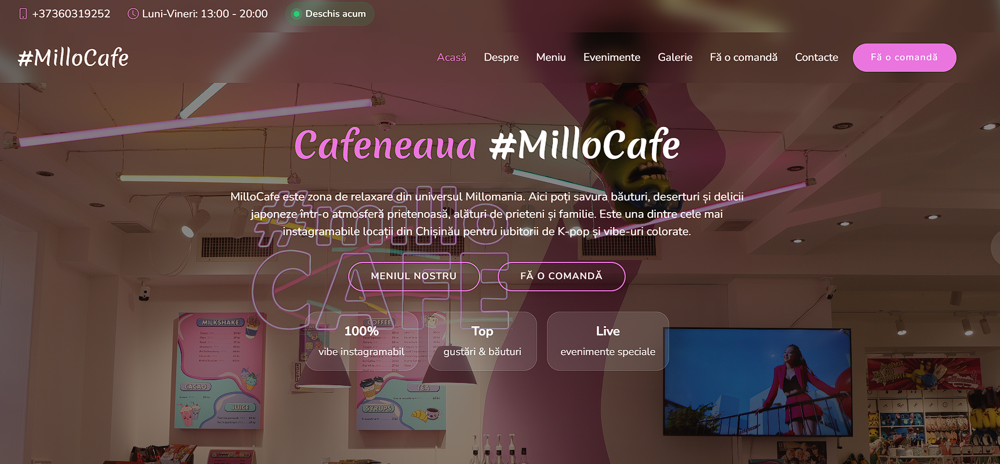
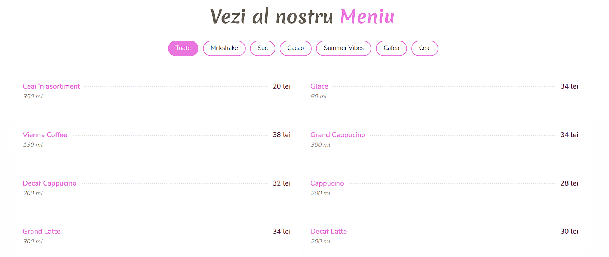
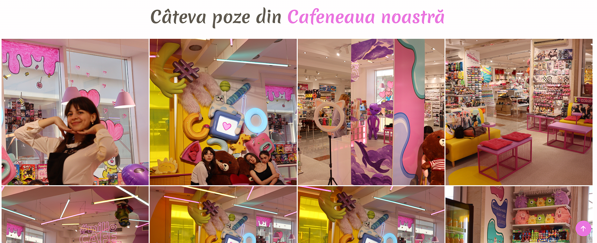

<div align="center">

# MilloCafe

**🇷🇴 [Română](#română) | 🇬🇧 [English](#english)**

</div>

---

## Română

Website pentru o cafenea, realizat în PHP + HTML + Bootstrap, pornind de la template-ul gratuit **"Delicious"** de la [BootstrapMade](https://bootstrapmade.com/) (licență distribuită liber, cu obligația de a păstra linkurile de atribuire din footer — păstrate în acest proiect).

### Screenshots

| Acasă | Meniu | Galerie |
|---|---|---|
|  |  |  |

### Ce conține site-ul

- Pagină principală (`index.php`) cu prezentare, meniu, galerie și formulare de comandă / contact
- Pagină meniu (`menu.php`)
- Pagină galerie foto (`gallery.php`)
- Formular de **comandă** ("Fă o comandă") și formular de **contact**

### Cum funcționează formularele

Formularele ("Fă o comandă" și "Contact") sunt procesate integral de **PHP** (`includes/bootstrap.php` + `process/process-order.php` / `process/process-contact.php`), cu:

- protecție CSRF (`csrf_token()` / `verify_csrf()`)
- validare pe server
- salvare în `storage/` (`.csv` și `.log.jsonl`, ambele excluse din git)

Formularele funcționează în **două moduri, cu același endpoint PHP**:

1. **Fără JavaScript** — submit clasic, PHP face `redirect` către pagină cu un mesaj flash afișat sub formular (`server-alert`).
2. **Cu JavaScript** (`assets/js/main.js`) — submit-ul e interceptat, trimis prin `fetch` cu header-ul `X-Requested-With: XMLHttpRequest`; PHP detectează asta (`is_ajax_request()`) și răspunde cu JSON (`{ok, message}`) în loc de redirect, iar mesajul apare instant, fără reîncărcarea paginii.

> **CGI**: `cgi-bin/process_form.cgi` a fost implementarea dintr-o temă anterioară ("Tema: CGI") și rămâne în proiect ca dovadă a acelei etape, dar formularele live nu mai trimit către el — a fost înlocuit de sistemul PHP+AJAX de mai sus, ca să nu existe două sisteme paralele care salvează date în locuri diferite.

### Structură

```
├── index.php, menu.php, gallery.php     → paginile site-ului
├── includes/bootstrap.php, config.php   → sistem PHP live (CSRF, validare, salvare, JSON pt. AJAX)
├── process/process-contact.php, process/process-order.php  → procesarea live a formularelor
├── cgi-bin/process_form.cgi             → arhivă istorică (Tema: CGI), neconectat la formulare
├── assets/                              → CSS, JS, imagini, librării (Bootstrap, Swiper, GLightbox, Isotope, Boxicons, animate.css)
├── storage/                             → date trimise prin formulare (exclus din git, vezi .gitignore)
└── .htaccess                            → reguli Apache (blochează accesul direct la fișierele de date)
```

### Rulare locală

**Varianta rapidă (doar cu PHP instalat):**

```
php -S localhost:8000
```

apoi deschide `http://localhost:8000/index.php`.

**Varianta cu Apache (XAMPP/WAMP/MAMP):**

1. Pune folderul proiectului în `htdocs`/`www`.
2. Pornește Apache din panoul de control.
3. Asigură-te că folderul `storage/` are drepturi de scriere.
4. Accesează `http://localhost/millocafe/index.php`.

*(`cgi-bin/process_form.cgi` nu mai e necesar pentru rularea site-ului — rămâne doar ca referință istorică, vezi mai sus.)*

### Date sensibile

Fișierele din `storage/` (și `.csv`, `.jsonl`, `.log`, `.txt` cu date trimise de utilizatori) **nu sunt incluse în acest repository** — vezi `.gitignore`. Dacă rulezi local proiectul și completezi formularele, datele generate rămân doar pe mașina ta.

### Credite

Template original: **Delicious** by [BootstrapMade](https://bootstrapmade.com/) — licențiat sub [BootstrapMade Free License](https://bootstrapmade.com/license/).

---

## English

A café website built with PHP + HTML + Bootstrap, based on the free **"Delicious"** template by [BootstrapMade](https://bootstrapmade.com/) (freely distributed license, requiring the footer attribution links to be kept — preserved in this project).

### Screenshots

| Home | Menu | Gallery |
|---|---|---|
|  |  |  |

### What the site includes

- Home page (`index.php`) with intro, menu, gallery, and order/contact forms
- Menu page (`menu.php`)
- Photo gallery page (`gallery.php`)
- An **order** form ("Place an order") and a **contact** form

### How the forms work

Both forms ("Place an order" and "Contact") are fully processed by **PHP** (`includes/bootstrap.php` + `process/process-order.php` / `process/process-contact.php`), with:

- CSRF protection (`csrf_token()` / `verify_csrf()`)
- server-side validation
- storage in `storage/` (`.csv` and `.log.jsonl`, both excluded from git)

The forms work in **two modes, hitting the same PHP endpoint**:

1. **Without JavaScript** — a classic form submit; PHP redirects back to the page with a flash message shown below the form (`server-alert`).
2. **With JavaScript** (`assets/js/main.js`) — the submit is intercepted and sent via `fetch` with the `X-Requested-With: XMLHttpRequest` header; PHP detects this (`is_ajax_request()`) and responds with JSON (`{ok, message}`) instead of a redirect, so the message appears instantly without a page reload.

> **CGI**: `cgi-bin/process_form.cgi` was the implementation from an earlier assignment ("CGI assignment") and stays in the project as evidence of that stage, but the live forms no longer submit to it — it has been replaced by the PHP+AJAX system above, so there are no longer two parallel systems saving data in different places.

### Structure

```
├── index.php, menu.php, gallery.php     → the site's pages
├── includes/bootstrap.php, config.php   → live PHP system (CSRF, validation, storage, JSON for AJAX)
├── process/process-contact.php, process/process-order.php  → live form processing
├── cgi-bin/process_form.cgi             → historical archive (CGI assignment), not wired to any form
├── assets/                              → CSS, JS, images, libraries (Bootstrap, Swiper, GLightbox, Isotope, Boxicons, animate.css)
├── storage/                             → data submitted through the forms (excluded from git, see .gitignore)
└── .htaccess                            → Apache rules (blocks direct access to data files)
```

### Running locally

**Quick option (PHP only):**

```
php -S localhost:8000
```

then open `http://localhost:8000/index.php`.

**Apache option (XAMPP/WAMP/MAMP):**

1. Place the project folder inside `htdocs`/`www`.
2. Start Apache from the control panel.
3. Make sure the `storage/` folder is writable.
4. Open `http://localhost/millocafe/index.php`.

*(`cgi-bin/process_form.cgi` is no longer required to run the site — it's kept only as a historical reference, see above.)*

### Sensitive data

Files under `storage/` (and any `.csv`, `.jsonl`, `.log`, `.txt` holding user-submitted data) **are not included in this repository** — see `.gitignore`. If you run the project locally and fill out the forms, the generated data stays only on your machine.

### Credits

Original template: **Delicious** by [BootstrapMade](https://bootstrapmade.com/) — licensed under the [BootstrapMade Free License](https://bootstrapmade.com/license/).
